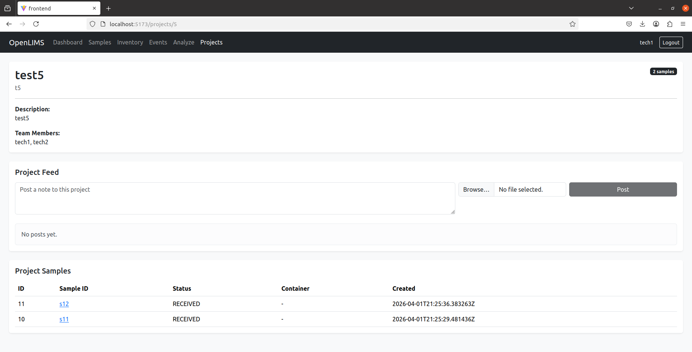

# OpenLIMS

OpenLIMS is a lightweight, production-shaped, open-source **Laboratory Information Management System (LIMS)** designed to manage laboratory workflows, sample tracking, and team collaboration with minimal setup.

It models real-world lab systems with audit trails, role-based access, project collaboration, bulk operations, and data analysis tools.

---

## 🚀 Features

### 🧪 Core LIMS
- Sample tracking with lifecycle states:
  - RECEIVED → IN_PROGRESS → QC → REPORTED → ARCHIVED
- Container and location management
- Work items and result tracking
- Custom fields per entity
- Full audit trail of all system actions

### 👥 Projects & Collaboration
- Project-based organization of samples
- Multi-user team support
- Edit project members after creation
- Project-level activity feed (notes + images)
- Role-based project visibility

### 🔐 User Management
- Admin-only user creation
- Role-based access (Admin, Tech, Viewer)

### ⚡ Bulk Operations
- Select multiple samples
- Bulk update status and project assignment
- Event logging for bulk actions

### 📊 Analytics
- Compare multiple samples across projects
- Metric vs Time and Days charts
- Export charts (PNG) and data (CSV)

### 📡 Dashboard
- System overview
- “My Projects” widget
- Activity feed

---

## 🏗 Architecture

### Backend
- Django + Django REST Framework
- PostgreSQL
- REST APIs
- Audit logging

### Frontend
- React + Vite
- React Bootstrap
- Chart.js

### Deployment
- Docker + Docker Compose

---

## ⚙️ Quickstart

```bash
git clone https://github.com/Mokey2002/OpenLIMS.git
cd OpenLIMS
cp deploy/.env.example deploy/.env
docker compose up --build
```

---

## 🌐 Access

- Frontend: http://localhost:5173  
- Backend: http://localhost:8000  

---

## 👨‍💻 Author

Eduardo L.

---

## ⭐ Summary

OpenLIMS is a full-stack system demonstrating:
- system design
- role-based security
- audit trails
- analytics
- scalable UI




