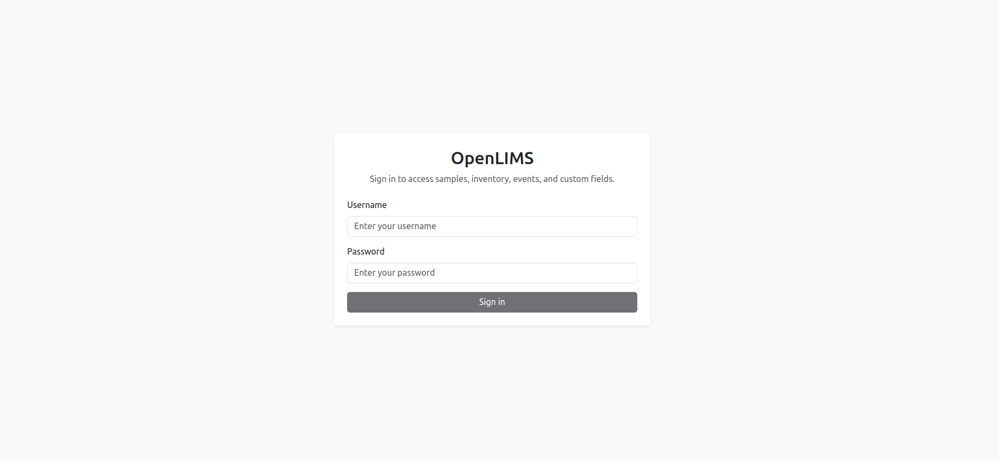
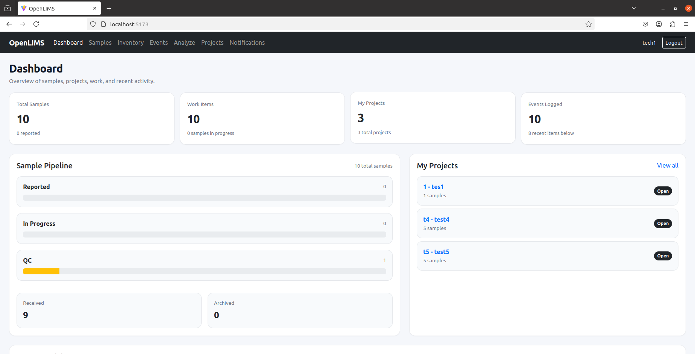
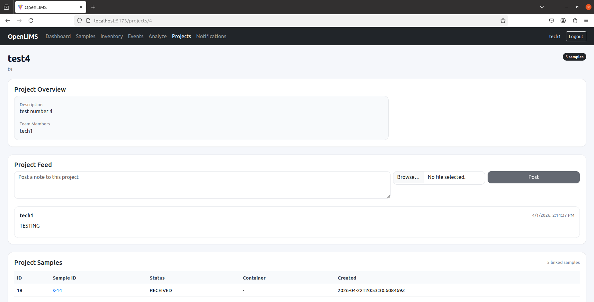
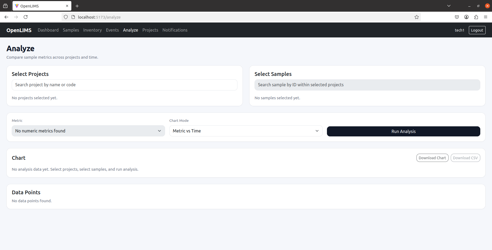
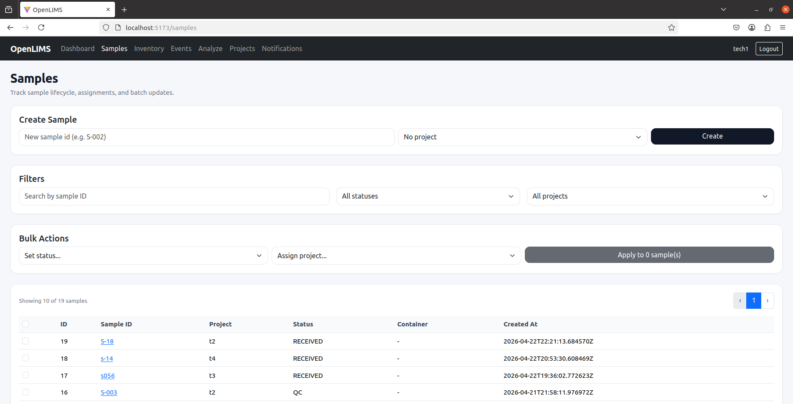

# 🧪 OpenLIMS

A lightweight, modular, and production-inspired Laboratory Information Management System (LIMS).

## 🚀 Features
- Sample lifecycle tracking
- CSV + Instrument API ingestion
- Projects and collaboration
- Audit trail and notifications
- Analysis tools

## 🐳 Run Locally

```bash
docker compose -f deploy/docker-compose.yml up -d
docker compose -f deploy/docker-compose.yml run --rm api python manage.py migrate
```

## 🧪 Run Tests

```bash
docker compose -f deploy/docker-compose.yml run --rm api pytest -v
```

## 🔁 Instrument API Example

```bash
curl -X POST http://localhost:8000/api/import-jobs/instrument-ingest/ \
  -H "Content-Type: application/json" \
  -H "X-Instrument-Api-Key: my-shared-lab-instrument-key" \
  -d '{"instrument_code":"NOVAFLEX","run_id":"RUN-001","rows":[{"sample_id":"S-001"}]}'
```

## 📌 Goals
- Lightweight and deployable
- Configurable without code changes
- Real-world lab workflow support

## 👨‍💻 Author
Eduardo L






