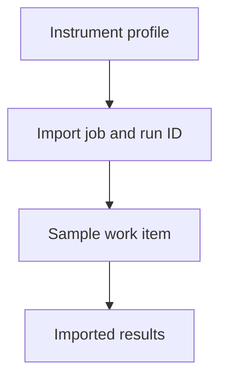

# OpenLIMS v0.24.0 — Instrument Connector Provenance

OpenLIMS v0.24.0 makes instrument provenance a first-class database relationship.

## Data model

`WorkItem.source_import_job` is a nullable foreign key to `ImportJob`.

The relationship belongs on the work item because one imported instrument row creates one work item and all results under it share the same source. Manual work items remain unlinked.

Deleting an import job sets the provenance field to null instead of deleting laboratory work or results.

## Connector behavior

- CSV upload and direct API ingestion set `source_import_job` when they create a work item.
- The source field is read-only through the normal work-item API.
- Work-item and result responses expose the import job ID, run ID, source type, instrument code, and instrument name.
- Import-job responses expose linked sample, work-item, and result counts.
- The import-job sample endpoint uses the direct relation first and retains summary fallback for legacy jobs.

## Legacy records

The migration looks for the established `Import Job <id>` or `Import Job #<id>` text in existing work-item names and notes. When that job exists and its project is compatible with the sample, the migration records the explicit relationship. Records that cannot be matched safely remain valid and unlinked.

The Investigation Workbench uses evidence in this order:

1. Explicit database relationship.
2. Legacy sample audit event or work-item text.
3. Same-project/time-window context.

Only the first two are presented as sample-linked provenance. Project/time-window records remain contextual and do not establish causation.
